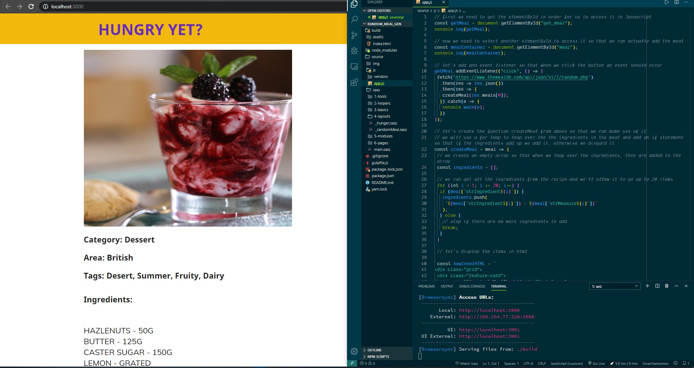

# Hi guys 👋, I created this following the guide provided by **[random meal generator](https://tinyurl.com/random-meal)** - Florin Pop as part of the #100Days100Projects and made it my own.

---
## Project Thumbnail:




---
# Hope you enjoy, as I had fun with the Javascript. 😁

I used html to create the top section along with a button. Once the button is clicked, a random meal is generated by an external api (themealdb) and this generates a random meal, if you don't want the meal that's displayed, you can click on the button again to repeat the proccess and generate another random meal.

I used a for loop to iterate through the ingredients and a if statement that verifies that the logic is met for the for loop. The ingredients then get mapped and joined together when they're found in order for them to be displayed in html.

# If you like this project then follow me here =>

- Twitter - https://twitter.com/MadbotD
- Instagram - https://www.instagram.com/madbot_designs/
- Stack Overflow - https://stackoverflow.com/story/maddyb
- Codepen - https://codepen.io/dashboard/

***

## Project Install Requirements

- **NodeJS - [NodeJS](http://nodejs.org)** - Follow the prompts to install
- **Gulp - [GulpJS](https://gulpjs.com/)**
```
npm install -g gulp
```

***

## Start Project
Run the following command: 
```
npm install
```

***

## How to use the project
Open your terminal and type gulp. This will run the ```gulpfile``` and ensure that all the compilers are working and watching for any changes taking place.

Here are other commands that you can run.

* **default**: Compile and watch for changes
* **scripts**: Compile the JavaScript files
* **sass**: Compile the Sass styles
* **images**: Copy the newer to the build folder
* **vendors**: Copy the vendors to the build folder
* **watch**: Watch for any changes on the each section

The `gulp` command is the best choice for you most likley.

***

## Project Starter Kit:
Courtesy of: **Jesse Showalter** 
Go check out his [YouTube](https://www.youtube.com/watch?v=sr6jDeAoXCc&feature=youtu.be&list=PLrtjkLnNjGHu7QIc8jN7hZmuP6wMby2QZ) channel for more information and awesome content.

Cheers 👍🏼